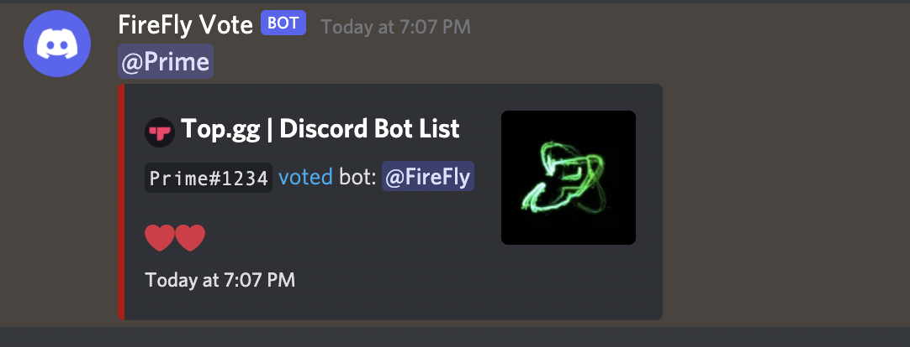

# Top.gg-discordVoteNotify
A Node.js application, written in TypeScript, to send an embed message via webhook when a user voted your Discord bot on Top.gg!

Actively used with my Discord Bot: [FireFly](https://top.gg/bot/925731507388174367).



# Installation
```
npm install
```

# Start (Development)
```
npm run starat
```

# Build (Production)
```
npm run build
```

